# PROYECTO ETL - Corporación Favorita

**Integrantes:**
- Alejandro Aguirre
- Diego Almeida

---

## 1. Descripción del proyecto

> Este proyecto implementa un pipeline ETL para analizar el histórico de ventas de Corporación Favorita, la principal cadena de retail de Ecuador, utilizando el dataset público Store Sales – Time Series Forecasting de Kaggle. El pipeline transforma cinco archivos CSV en un conjunto de datos limpio y consolidado, y a partir de ahí responde preguntas de análisis descriptivo sobre estacionalidad, promociones, comportamiento por tienda y ciudad, y la relación entre el precio del petróleo y las ventas, sin construir ningún modelo predictivo.

> El pipeline desarrollado se ejecuta sobre una máquina virtual Ubuntu desplegada en Azure (portal.azure.com), donde corren Apache Airflow como el orquestador y PostgreSQL como la base de datos usada como destino. Python con la librería Polars se usa para la carga, limpieza, consolidación y análisis exploratorio de los datos; los resultados limpios y consolidados se persisten en PostgreSQL, y desde ahí Power BI se conecta en tiempo real para permitir la visualizacion de los resultados finales.

---

## 2. Descripción de los archivos del dataset y su rol en el pipeline

**Fuente:** Store Sales – Time Series Forecasting (Kaggle)
https://www.kaggle.com/competitions/store-sales-time-series-forecasting

| Archivo | Descripción | Rol en el pipeline |
|---|---|---|
| `train.csv` | Ventas diarias por tienda, familia de producto y promoción. Más de 3 millones de registros | Archivo principal del análisis |
| `stores.csv` | Metadata de las 54 tiendas: ciudad, provincia, tipo y clúster | Dimensión para consolidar por tienda |
| `transactions.csv` | Número de transacciones por tienda y fecha | Relación entre transacciones y volumen de ventas |
| `oil.csv` | Precio diario del petróleo. Incluye nulos en fines de semana/feriados | Análisis de correlación con la economía |
| `holidays_events.csv` | Feriados nacionales, regionales y locales de Ecuador, con tipo y bandera de transferencia | Análisis de estacionalidad |

> Nota: los archivos CSV **no** se suben al repositorio de GitHub. Solo existen en la carpeta local de datos de la VM.

---

## 3. Diagrama de arquitectura de la solución

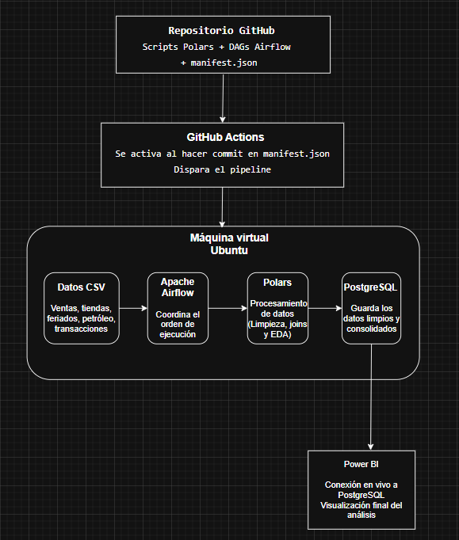

---

## 4. Descripción del DAG

**Nombre del DAG:** `favorita_pipeline` (`dags/favorita_pipeline.py`, Airflow 3.3.0)

| Tarea | Tipo | Función que ejecuta |
|---|---|---|
| `inicio` | EmptyOperator | Marca el arranque del DAG |
| `cargar_datos` | PythonOperator | `ejecutar_carga` — lee los 5 CSV con Polars |
| `eda_inicial` | PythonOperator | `ejecutar_eda_inicial` — diagnóstico de calidad inicial |
| `limpiar_datos` | PythonOperator | `ejecutar_limpieza` — limpieza y estandarización |
| `consolidar` | PythonOperator | `ejecutar_consolidacion` — une los 5 datasets |
| `eda_profundo` *(TaskGroup)* | — | Agrupa los 5 análisis de EDA profundo (abajo) |
| ├─ `ventas_generales` | PythonOperator | `ejecutar_ventas_generales` |
| ├─ `estacionalidad_feriados` | PythonOperator | `ejecutar_feriados` |
| ├─ `promociones` | PythonOperator | `ejecutar_promociones` |
| ├─ `petroleo_economia` | PythonOperator | `ejecutar_petroleo` |
| └─ `transacciones` | PythonOperator | `ejecutar_transacciones` |
| `fin_eda_profundo` | EmptyOperator | Marca el cierre del grupo de EDA profundo |

**Configuración:**

| Parámetro | Valor |
|---|---|
| `schedule` | `None` (disparo manual) |
| `start_date` | 2026-07-05 (`America/Guayaquil`) |
| `catchup` | `False` |
| `max_active_runs` / `max_active_tasks` | 1 / 1 |
| `retries` | 1 por tarea |
| `retry_delay` | 5 minutos |
| `on_failure_callback` | `registrar_error` — registra la tarea y la excepción en el log |
| `tags` | `favorita`, `etl`, `polars`, `eda` |

---

## 5. Proceso del pipeline

El pipeline está implementado en Python con Polars y orquestado por Airflow (`dags/favorita_pipeline.py`). Cada tarea del DAG llama a una función `ejecutar_*` de `scripts/`, que a su vez guarda sus resultados en `data/processed/` para que la siguiente tarea los reutilice. El orden de ejecución es:

**1. Extracción — `cargar_datos` (`scripts/extract/cargar_datos.py`)**
Lee los 5 CSV (`train`, `stores`, `transactions`, `oil`, `holidays_events`) desde `data/raw/` con Polars. Antes de continuar, valida que cada archivo exista y que contenga el conjunto mínimo de columnas esperadas (`COLUMNAS_ESPERADAS`); si falta un archivo o una columna, la tarea falla explícitamente en lugar de seguir con datos incompletos.

**2. Diagnóstico inicial — `eda_inicial` (`scripts/eda/eda_inicial.py`)**
Vuelve a cargar los 5 datasets y genera, por cada uno, un diagnóstico de calidad: número de filas/columnas, tipos de dato, cantidad y porcentaje de nulos por columna, cantidad de duplicados y rango de fechas. El resultado se guarda como `data/processed/eda_inicial.json` y sirve como línea base para medir el efecto de la limpieza.

**3. Limpieza — `limpiar_datos` (`scripts/transform/limpiar_datos.py`)**
Aplica, sobre cada dataset, un proceso común (`limpiar_dataframe`): conversión de la columna `date` a tipo `Date`, eliminación de duplicados, e imputación de nulos (mediana para columnas numéricas, moda para texto/booleanos). El caso de `oil.csv` es especial: como el precio del petróleo no se registra en fines de semana ni feriados, `limpiar_oil` reconstruye un calendario diario completo entre la fecha mínima y máxima de `train` y rellena los huecos con interpolación lineal (y relleno hacia adelante/atrás en los bordes), garantizando que no quede ningún nulo. Cada dataset limpio se guarda como Parquet en `data/processed/` (p. ej. `train_limpio.parquet`) y las métricas de la limpieza (duplicados eliminados, nulos antes/después, criterio de imputación) se guardan en `data/processed/limpieza_metricas.json`.

**4. Consolidación — `consolidar` (`scripts/consolidate/consolidar.py`)**
Toma los 5 Parquet limpios y construye una única tabla de hechos a partir de `train`, uniendo (`left join`) la metadata de tiendas, las transacciones diarias por tienda, el precio del petróleo por fecha y un resumen agregado de feriados por fecha (`preparar_feriados`, que además deriva la bandera `es_feriado_nacional`). Tras los joins valida que la cantidad de filas no haya cambiado respecto a `train` y que no existan filas sin metadata de tienda o sin precio de petróleo; si alguna validación falla, la tarea aborta. El resultado se guarda en `data/processed/consolidado.parquet`, junto con `consolidacion_metricas.json`.

**5. EDA profundo (`TaskGroup eda_profundo`)**
Cinco tareas independientes, todas partiendo del `consolidado.parquet`, cada una guardando sus tablas de resultados como Parquet en `data/processed/eda_profundo/`:
- `ventas_generales` — tendencias de ventas por tienda, familia de producto, ciudad, provincia, año y mes.
- `estacionalidad_feriados` — comparación de ventas en feriados vs. días normales, ventana de ±3 días alrededor de cada feriado, y sensibilidad por familia de producto.
- `promociones` — impacto de `onpromotion` en las ventas, a nivel general y por familia.
- `petroleo_economia` — relación entre el precio del petróleo y las ventas mensuales, variaciones 2015-2016, análisis de rezagos (*lags*) y sensibilidad por ciudad.
- `transacciones` — relación entre transacciones y ventas diarias, comportamiento por tienda y clasificación del tamaño de ticket.

**6. Carga a PostgreSQL — `exportar_postgres` (`scripts/load/exportar_postgres.py`)**
Exporta el `consolidado.parquet` y las 17 tablas resultantes del EDA profundo hacia PostgreSQL. Antes de exportar valida que todos los archivos Parquet necesarios existan. Por cada tabla: infiere el esquema Parquet y lo traduce a tipos de PostgreSQL, recrea la tabla (`DROP TABLE IF EXISTS` + `CREATE TABLE`), copia los datos en lotes usando `COPY ... FROM STDIN` (más eficiente que un `INSERT` fila por fila para datasets grandes como `train`), crea los índices definidos en `INDICES` para las columnas más consultadas (`date`, `store_nbr`, `family`, etc.) y ejecuta `ANALYZE` para que el planner de PostgreSQL tenga estadísticas actualizadas. Al finalizar guarda un resumen por tabla (filas, columnas, duración) en `data/processed/exportacion_postgres_metricas.json`. Desde aquí, Power BI Service se conecta en modo DirectQuery a las tablas ya cargadas.

Todas las tareas del DAG tienen 1 reintento con 5 minutos de espera y, si fallan, `registrar_error` deja constancia en el log de Airflow de la tarea y la excepción específica.

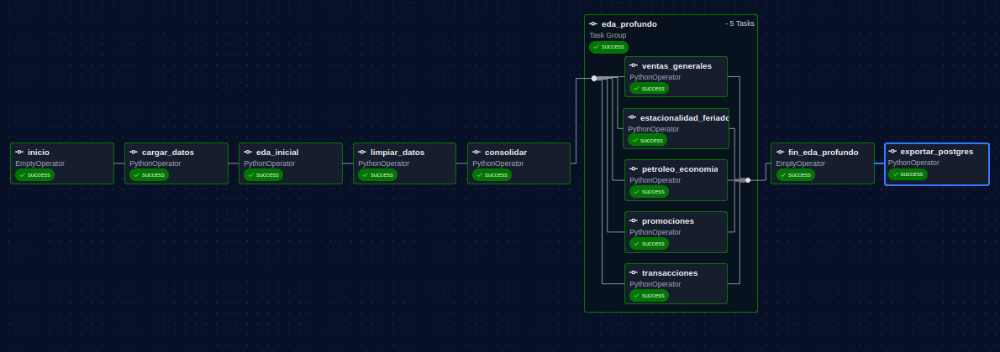

---

## 6. Métricas del pipeline

Resultados de la ejecución completa del DAG `favorita_pipeline`.

### 6.1 Diagnóstico inicial (`eda_inicial.json`)

| Archivo | Filas | Columnas | Nulos | Duplicados | Rango de fechas |
|---|---|---|---|---|---|
| `train.csv` | 3,000,888 | 6 | 0 | 0 | 2013-01-01 → 2017-08-15 |
| `stores.csv` | 54 | 5 | 0 | 0 | — |
| `transactions.csv` | 83,488 | 3 | 0 | 0 | 2013-01-01 → 2017-08-15 |
| `holidays_events.csv` | 350 | 6 | 0 | 0 | 2012-03-02 → 2017-12-26 |
| `oil.csv` | 1,218 | 2 | 43 en `dcoilwtico` (3.53%) | 0 | 2013-01-01 → 2017-08-31 |

Los 5 datasets llegan sin duplicados y prácticamente sin nulos, salvo `oil.csv`: como el precio del petróleo no se registra en fines de semana ni feriados, el 3.53% de sus filas no tienen valor.

### 6.2 Limpieza (`limpieza_metricas.json`)

| Dataset | Filas originales | Filas finales | Duplicados eliminados | Nulos antes → después |
|---|---|---|---|---|
| `train` | 3,000,888 | 3,000,888 | 0 | 0 → 0 |
| `stores` | 54 | 54 | 0 | 0 → 0 |
| `transactions` | 83,488 | 83,488 | 0 | 0 → 0 |
| `holidays_events` | 350 | 350 | 0 | 0 → 0 |
| `oil` | 1,218 | 1,688 | 0 | 43 → 0 |

`oil` es el único caso donde el número de filas crece (de 1,218 a 1,688): la limpieza reconstruyó el calendario diario completo entre el rango de fechas de `train`, agregando **470 fechas** que no existían en el CSV original (fines de semana/feriados), y los 43 nulos originales más los nuevos huecos del calendario se resolvieron con interpolación lineal y relleno de borde, dejando el dataset **sin ningún nulo**.

### 6.3 Consolidación (`consolidacion_metricas.json`)

| Métrica | Valor |
|---|---|
| Filas de `train` | 3,000,888 |
| Filas del consolidado | 3,000,888 *(sin pérdida ni duplicación de filas)* |
| Columnas del consolidado | 19 |
| Fechas de eventos/feriados únicas | 312 |
| Filas sin transacciones registradas | 245,784 (8.19%) |
| Filas sin precio de petróleo | 0 |
| Tamaño del archivo (`consolidado.parquet`) | 10.06 MB |

### 6.4 Carga a PostgreSQL (`exportacion_postgres_metricas.json`)

| Métrica | Valor |
|---|---|
| Esquema | `favorita` |
| Tablas creadas | 19 (1 consolidado + 18 tablas de EDA profundo) |
| Filas totales exportadas | 3,085,046 |
| Duración total | 20.68 segundos |
| Fecha de exportación (UTC) | 2026-07-20 21:56:49 |

La tabla `consolidado` (3,000,888 filas, 19 columnas) tomó 20.05 s de los 20.68 s totales — el resto de tablas (agregados del EDA profundo, entre 2 y 198 filas cada una) se cargaron en fracciones de segundo. Esto confirma que el cuello de botella de la exportación es, como se esperaba, la tabla de hechos completa; las tablas agregadas para Power BI son livianas y casi instantáneas de cargar/actualizar.

---

## 7. Captura del dashboard de Power BI

> Pendiente de implementación

---

## 8. Despliegue

La VM se desplegó en el [portal de Azure](https://portal.azure.com/#home) usando la cuenta institucional EPN, acogiéndose al programa **Microsoft Azure for Students** ($100 en créditos, sin tarjeta de crédito).

**Paso 1: Ingresar a Azure y buscar "Máquinas virtuales"**
Se inicia sesión con la cuenta institucional y se busca la opción de Máquinas virtuales en el portal.

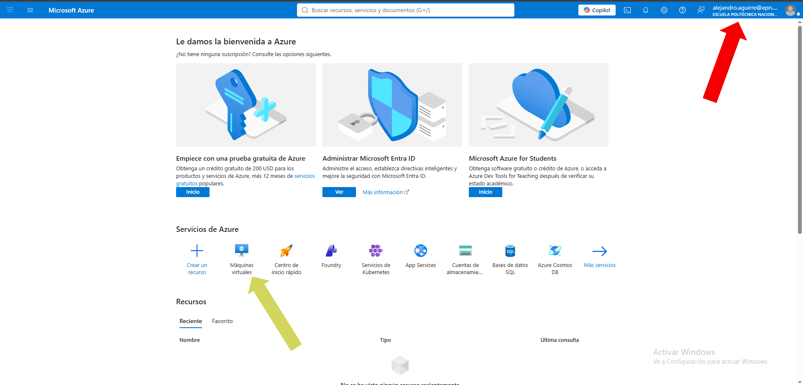

**Paso 2: Activar la cuenta de estudiante**
Se selecciona la opción **Microsoft Azure for Students**, detectada automáticamente por el dominio institucional del correo.

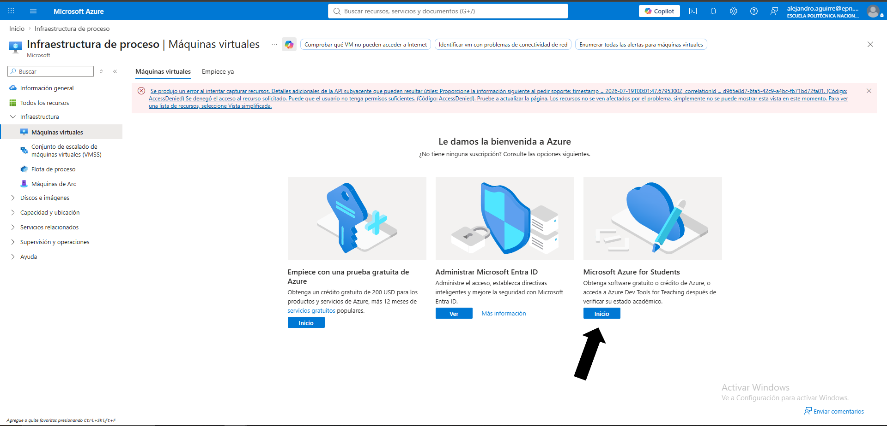

**Paso 3: Iniciar gratis con la cuenta institucional**
Se confirma el inicio del proceso de activación con la cuenta EPN.


**Paso 4: Completar y verificar la cuenta**
Se llenan los campos requeridos (datos personales, verificación telefónica) para activar el crédito de estudiante.

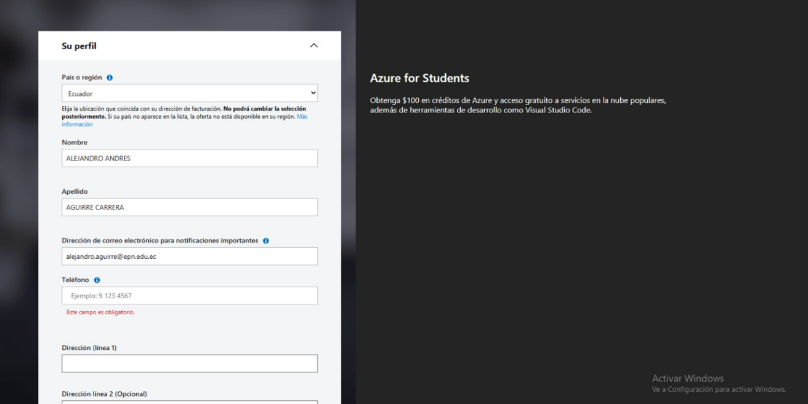

**Paso 5: Volver a Máquinas virtuales**
Ya con la suscripción activa, se regresa a la sección de Máquinas virtuales para crear el recurso.

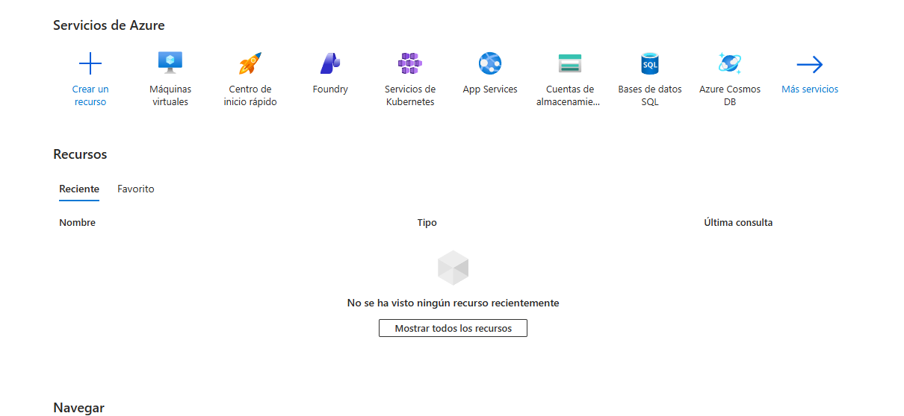

**Paso 6: Crear la máquina virtual**
Se selecciona **Crear → Máquina virtual**.

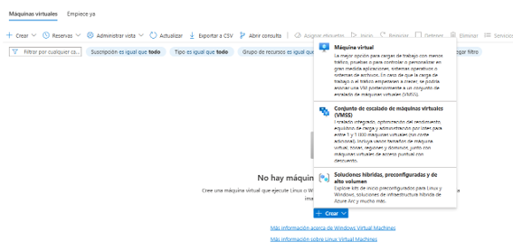

**Paso 7: Datos básicos**
Se configura el grupo de recursos, el nombre de la VM, la región, la imagen (**Ubuntu**) y el tamaño de la instancia, junto con la cuenta de administrador y las reglas de puerto de entrada (SSH).

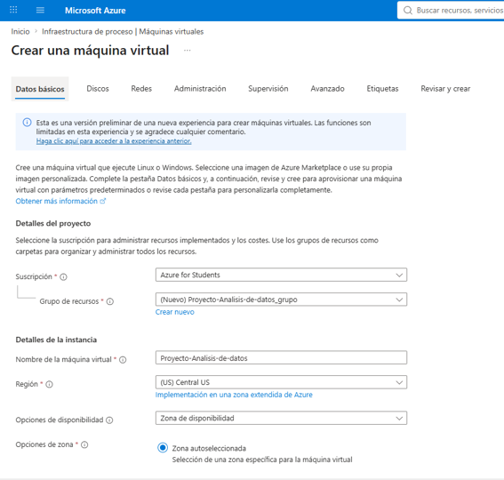
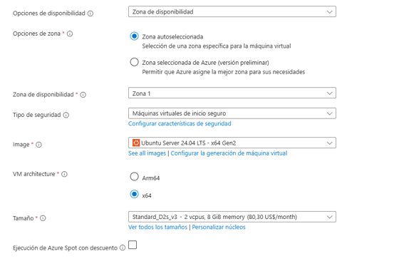
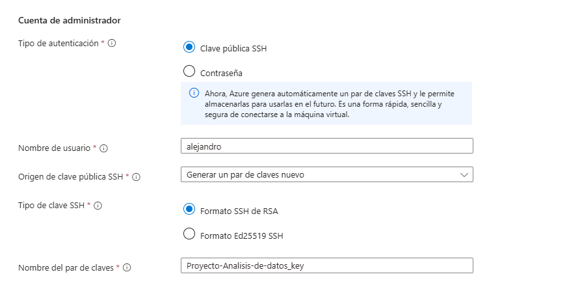
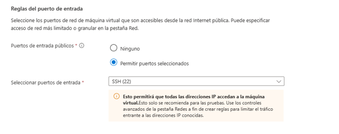

**Paso 8: Discos**
No se modificó la configuración por defecto de discos.

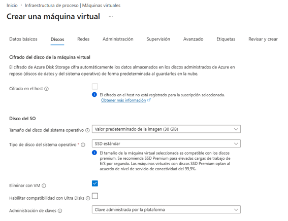
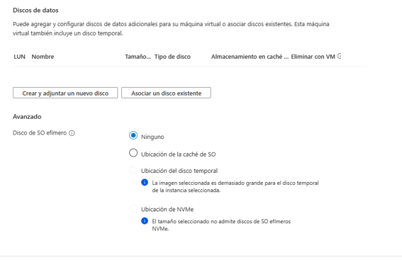

**Paso 9: Redes y administración**
No se modificó la configuración por defecto de redes. En Administración se habilitó el **apagado automático** de la VM, para evitar consumir el crédito de Azure fuera del horario de uso del equipo.

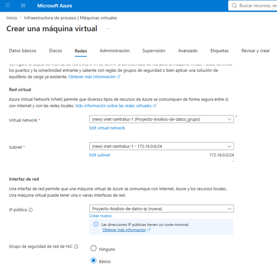
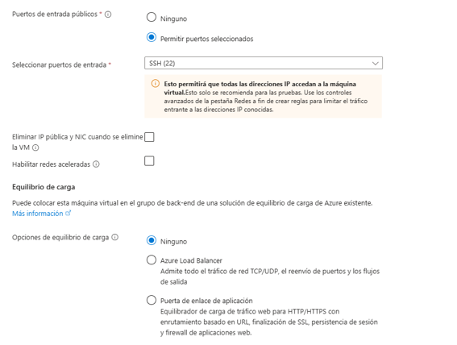
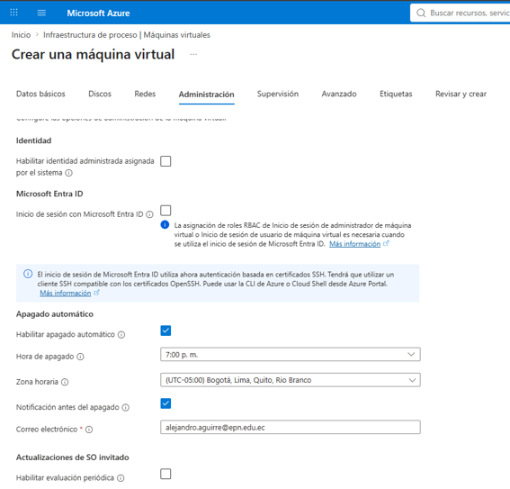
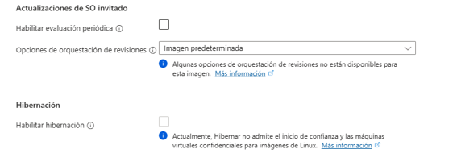

**Paso 10: Revisar y crear**
Se revisan todas las especificaciones configuradas antes de confirmar la creación de la máquina virtual.
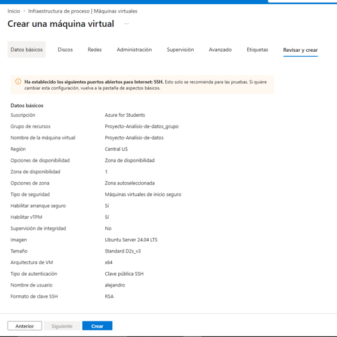

### 8.1 Instalación y arranque de Airflow

Una vez creada la VM y con acceso por SSH, se instala Airflow dentro de un entorno virtual usando los scripts de `scripts/setup/`:

```bash
# 1. Crear y activar el entorno virtual del proyecto
python3 -m venv .venv
source .venv/bin/activate

# 2. Instalar dependencias del proyecto + Airflow 3.3.0 (usa el archivo de constraints oficial)
scripts/setup/instalar_airflow.sh

# 3. Levantar Airflow en modo standalone (webserver + scheduler)
scripts/setup/iniciar_airflow.sh
```

`iniciar_airflow.sh` configura `AIRFLOW_HOME` dentro del proyecto y apunta `AIRFLOW__CORE__DAGS_FOLDER` a la carpeta `dags/` del repo, para que Airflow detecte automáticamente `favorita_pipeline`.
---

## 9. Conclusiones y recomendaciones

> Se completará al finalizar el proyecto
